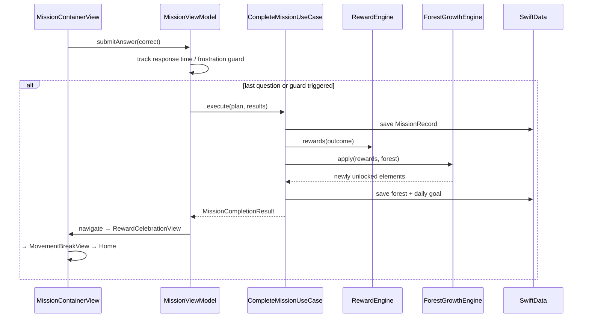
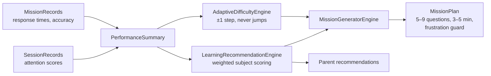

# 🌳 Focus Forest Adventure

A Disney/Pixar-quality iOS learning game that helps children aged 4–6 grow their
concentration through short, joyful "missions" — never punishment, always celebration.
Every completed mission grows the child's own magic forest.

## Highlights

- **7 adventures** — ABC, Numbers, Shapes, Colors, Memory, Listening, Animals — each with multiple mini-game types
- **AI personalization** — on-device `LearningRecommendationEngine` + `AdaptiveDifficultyEngine` tune difficulty one gentle step at a time (never jumps), surface subjects that need practice, and cap missions at 3–5 minutes with a *frustration guard* that ends early on a high note
- **Living forest** — 8 evolving levels from empty meadow to magic forest, with 10 unlockable animated elements (butterflies → river → rainbow → castle → dragon)
- **Movement breaks** — a 30-second wiggle break with Bunny after every mission
- **Friendly Bunny voice** — `AVSpeechSynthesizer` guide; every phrase is positive
- **Parent dashboard** — PIN-protected Swift Charts analytics + plain-language AI recommendations
- **Accessibility-first** — 64pt tap targets, VoiceOver labels everywhere, Reduce Motion honored by every particle/animation, color-blind-safe game colors paired with symbols, full Dynamic Type

## Tech stack

SwiftUI · Swift 6 (strict concurrency) · MVVM + Clean Architecture · SwiftData (+CloudKit sync) · Observation · async/await & structured concurrency · NavigationStack · Lottie · AVFoundation · AVSpeechSynthesizer · CoreHaptics · StoreKit 2 · WidgetKit · App Intents · TipKit · XCTest + snapshot tests

## Architecture

```
┌──────────────────────────────────────────────┐
│  Presentation (SwiftUI Views)                │
│  HomeView · MissionContainerView · Forest…   │
└───────────────────┬──────────────────────────┘
                    ▼
┌──────────────────────────────────────────────┐
│  ViewModels (@Observable, @MainActor)        │
│  HomeViewModel · MissionViewModel · …        │
└───────────────────┬──────────────────────────┘
                    ▼
┌──────────────────────────────────────────────┐
│  UseCases                                    │
│  StartMission · CompleteMission ·            │
│  FetchTodayPlan · FetchStatistics            │
└─────────┬──────────────────────┬─────────────┘
          ▼                      ▼
┌───────────────────┐  ┌─────────────────────────┐
│  Engines (pure)   │  │  Repositories (protocol)│
│  Difficulty · AI  │  │  Child · Mission ·      │
│  Reward · Growth  │  │  Forest · Stats · Achv. │
│  Generator · Achv.│  └───────────┬─────────────┘
└───────────────────┘              ▼
                        ┌─────────────────────────┐
                        │  SwiftData + CloudKit   │
                        └─────────────────────────┘
```

Dependency injection: a single composition root (`AppDependencies`) builds the
whole graph and injects it via the SwiftUI Environment. No singletons.

### Mission sequence



### Data flow (AI personalization)



## Project structure

```
FocusForestAdventure/
├── App/                    # Entry, DI composition root, routes, App Intents
├── Core/
│   ├── Domain/             # Pure value types (MissionPlan, RewardBundle…)
│   ├── UseCases/           # Application layer
│   └── Extensions/
├── DesignSystem/           # Theme tokens, components, particles, Lottie, forest bg
├── Features/
│   ├── Home/  Adventure/  Mission/  Forest/  Rewards/  Dashboard/  Settings/
├── AI/                     # Difficulty, recommendation, mission generator
├── Services/               # Sound, speech, haptics, game engines, StoreKit
├── Repository/             # Protocols + SwiftData implementations
├── SwiftData/              # @Model types, container factory
├── Widget/                 # WidgetKit extension
├── Resources/              # Animations (Lottie), sounds, localization
├── Tests/                  # Unit / Snapshot / UI+Accessibility
└── project.yml             # XcodeGen definition
```

## Installation

Requirements: Xcode 16+, iOS 18+ deployment target, an Apple Developer account
for CloudKit & App Groups.

**Option A — open directly (recommended):**

```bash
open FocusForestAdventure.xcodeproj
```

The bundled project uses Xcode 16 folder-synchronized groups (app + unit-test
targets, Lottie via SPM). Files you add to the folders appear in Xcode
automatically. Set your development team in Signing & Capabilities, then run.

**Option B — regenerate all targets (adds widget, snapshot & UI test targets):**

```bash
brew install xcodegen
cd FocusForestAdventure
xcodegen generate   # overwrites the .xcodeproj from project.yml
open FocusForestAdventure.xcodeproj
```

Then in Signing & Capabilities:

1. Enable **iCloud → CloudKit**, container `iCloud.com.focusforest.adventure`.
2. Enable **App Groups**, group `group.com.focusforest.adventure` (app + widget).
3. Add Lottie JSONs and sound files per `Resources/*/README.md` (the app runs
   with placeholders until then).
4. Product → Test (⌘U) runs unit, snapshot, and UI/accessibility suites.

## Testing

- `Tests/UnitTests` — engines (difficulty never jumps, rewards never zero,
  unlocks fire once), use cases against in-memory SwiftData, PIN hashing
- `Tests/SnapshotTests` — design-system components incl. Dynamic Type XXL & dark mode
- `Tests/UITests` — happy path, parent-gate enforcement, Xcode accessibility
  audit, launch performance metric

## Privacy & kids-app compliance

- No ads, no third-party SDKs, no tracking; all AI runs on-device
- Data stays in the user's private CloudKit database
- Parent area is PIN-gated (salted SHA-256, never stored raw)
- Designed for the App Store Kids Category (ages 4 and under / 5)

## Roadmap

- v1.1 — real Lottie asset pack, iPad layout, sticker book for magic dust
- v1.2 — multiple child profiles, sibling forests, offline speech pack
- v1.3 — CoreML personalization model trained on anonymized aggregate curves,
  seasonal forest events (snow, fireflies)
- v2.0 — Apple Watch movement-break companion, shared family forest via
  CloudKit shared database, teacher/classroom mode
